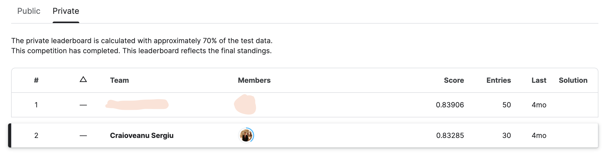

# Synthetic Image Classification Competition
Placed 2nd (out of 65) in the Deep Learning course Kaggle Competition, where all students in the second year of University of Bucharest AI MSc would compete against each other for best model score. Dataset was composed of synthetic/generated images and the purpose was to classify images into 100 classes.

## Competition Details
This is a deep image hallucination classification challenge in which competitors train deep classification models on a data set containing images generated by deep generative models. Competitors are scored based on the classification accuracy on a given test set. For each test image, the participants have to predict its class label.

Link to the competition: https://www.kaggle.com/competitions/gic-unibuc-dl-2023/overview

## Results

The approach entailed multiple custom CNN-based architectures ensembles.